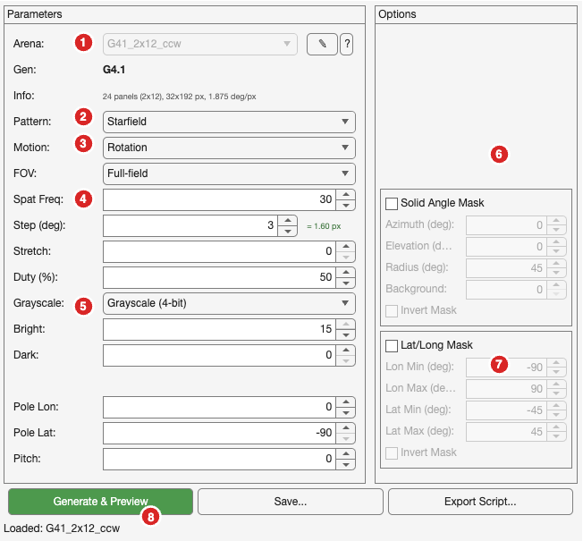
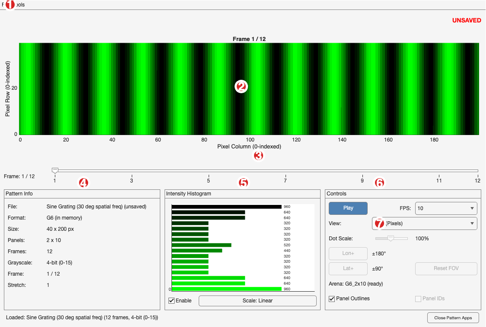
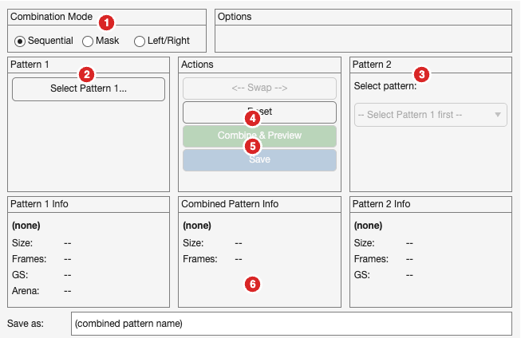

# Pattern Tools Quick Start Guide

A quick reference for the Reiser Lab's MATLAB pattern generation tools.

## The Three Apps

| App | Purpose |
|-----|---------|
| **PatternGeneratorApp** | Create patterns (gratings, starfields, edges) |
| **PatternPreviewerApp** | View, animate, and export patterns |
| **PatternCombinerApp** | Combine two patterns into one |

The Previewer is the central hub—Generator and Combiner automatically send their output to it.

---

## Getting Started

```matlab
% Add tools to path (run once per session)
addpath(genpath('/path/to/maDisplayTools'));

% Launch apps
PatternGeneratorApp    % Create new patterns
PatternPreviewerApp    % View/export patterns
PatternCombinerApp     % Combine patterns
```

---

## Pattern Organization

Patterns are saved in folders named after their arena config:

```
patterns/
  G6_2x10/              ← Directory name = arena config name
    grating_30deg.pat
    starfield_100dots.pat
  G6_2x8of10/
    edge_pattern.pat
  G41_2x12_ccw/
    ...
```

**Don't worry!** If you start with a blank directory and use PatternGeneratorApp, patterns will automatically be named and saved to the correct folder.

**Why this matters:** The Previewer auto-detects arena settings from the folder name, which enables the projection views (Mercator, Mollweide).

---

## Available Arena Configs

Standard configurations in `configs/arenas/`:

| Config | Gen | Grid | Coverage | Use Case |
|--------|-----|------|----------|----------|
| `G6_2x10` | G6 | 2×10 | 360° | Full G6 arena |
| `G6_2x8of10` | G6 | 2×8 of 10 | 288° | G6 with rear gap |
| `G6_3x12of18` | G6 | 3×12 of 18 | 240° | Large G6, rear gap |
| `G41_2x12_cw` | G4.1 | 2×12 | 360° | G4.1 (modern builds) |
| `G41_2x12_ccw` | G4.1 | 2×12 | 360° | G4.1 (legacy builds) |
| `G4_4x12` | G4 | 4×12 | 360° | Full G4 arena |
| `G4_3x12` | G4 | 3×12 | 360° | 3-row G4 arena |
| `G4_3x12of18` | G4 | 3×12 of 18 | 240° | G4 with rear gap |
| `G3_4x12` | G3 | 4×12 | 360° | G3 arena |
| `G3_3x24` | G3 | 3×24 | 360° | G3 arena |

**Partial arenas** (e.g., `2x8of10`) have fewer columns installed than the full grid, leaving gaps for equipment access.

**Note:** G3 configs are included for backward compatibility but are not fully supported or tested.

---

## Typical Workflow

```
┌─────────────────────┐     Generate &      ┌─────────────────────┐
│ PatternGeneratorApp │ ───────────────────→ │ PatternPreviewerApp │
│                     │       Preview        │                     │
│      [Save]         │                      │   View / Export     │
└─────────────────────┘                      └─────────────────────┘
                                                      ↑
┌─────────────────────┐     Combine &                 │
│ PatternCombinerApp  │ ─────────────────────────────→│
│                     │       Preview
│      [Save]         │
└─────────────────────┘
```

**Creating a Pattern (Generator Workflow):**
1. Launch **PatternGeneratorApp**
2. Select your arena config (dropdown at top)
3. Configure pattern type, motion, and parameters
4. Click **Generate & Preview** → pattern appears in Previewer
5. Review in Previewer (play animation, check histogram)
6. Click **Save** in Generator to save the pattern

*(For combining patterns, see the PatternCombinerApp section below.)*

---

## PatternGeneratorApp



| # | Control | Description |
|---|---------|-------------|
| 1 | Arena dropdown | Select hardware config (locked after generating) |
| 2 | Pattern type | Square Grating, Sine Grating, Edge, Starfield, Off/On |
| 3 | Motion type | Rotation, Translation, Expansion-Contraction |
| 4 | Spatial freq | Width of pattern bars in degrees |
| 5 | Grayscale | Binary (1-bit) or Grayscale (4-bit, 16 levels) |
| 6 | Solid Angle Mask | Circular masking by azimuth/elevation/radius |
| 7 | Lat/Long Mask | Rectangular masking by longitude/latitude bounds |
| 8 | Generate & Preview | Create pattern and send to Previewer |

**Other controls:** Step size (movement per frame), Stretch (timing), Duty cycle, Bright/Dark intensity levels.

**Tips:**
- Arena is locked after generating; click "Change Arena" to unlock (clears pattern)
- Use "Export Script" to save a reproducible MATLAB script

---

## PatternPreviewerApp



| # | Control | Description |
|---|---------|-------------|
| 1 | File menu | Load Pattern, Export GIF, Export Video |
| 2 | Main display | Pattern visualization with panel grid |
| 3 | Frame slider | Navigate frames manually |
| 4 | Pattern Info | File name, format, dimensions, grayscale mode |
| 5 | Histogram | Live intensity distribution |
| 6 | Controls | Play/Stop, FPS selection |
| 7 | View mode | Grid (Pixels), Mercator, or Mollweide projection |

**Other controls:** Panel Outlines checkbox, Panel IDs checkbox, Dot Scale slider (for projections).

**View Modes:**
- **Grid (Pixels)**: Raw pixel view with optional panel boundaries
- **Mercator**: Cylindrical map projection (longitude/latitude)
- **Mollweide**: Equal-area projection (preserves brightness distribution)

**Keyboard shortcut:** Cmd+O to load a pattern file

---

## PatternCombinerApp



| # | Control | Description |
|---|---------|-------------|
| 1 | Combination Mode | Sequential, Mask, or Left/Right |
| 2 | Pattern 1 | Select the first pattern file |
| 3 | Pattern 2 | Select from compatible patterns in same folder |
| 4 | Combine & Preview | Create combined pattern, send to Previewer |
| 5 | Save | Save combined pattern to disk |
| 6 | Save as | Filename for the combined pattern |

**Combination Modes:**

| Mode | What it does | Example use |
|------|--------------|-------------|
| Sequential | Plays Pattern 1, then Pattern 2 | Multi-phase stimuli |
| Mask (Replace) | Replace pixels at threshold with Pattern 2 | Overlay moving object on background |
| Mask (Blend) | 50% average of both patterns | Superimposed gratings |
| Left/Right | Left half from Pat1, right from Pat2 | Hemifield experiments |

**Note:** Pattern 2 dropdown only shows patterns with matching grayscale mode from the same folder.

---

## Tips & Troubleshooting

| Problem | Solution |
|---------|----------|
| Pattern 2 dropdown is empty | Select Pattern 1 first; only matching grayscale patterns appear |
| Projection views are blank | Pattern must be in a folder named after its arena config |
| "UNSAVED" warning in Previewer | Pattern from Generator/Combiner not yet saved |
| Changes to app not taking effect | Run `clear classes` in MATLAB, then relaunch the app |
| App won't launch | Run `addpath(genpath('/path/to/maDisplayTools'))` first |

---

## Exporting Patterns

**From PatternPreviewerApp:**
- **File → Export GIF**: Animated GIF of all frames
- **File → Export Video**: MP4 video file

**From PatternGeneratorApp:**
- **Save**: Saves `.pat` file to `patterns/{arena}/`
- **Export Script**: Generates MATLAB code to recreate the pattern

---

## Quick Reference Card

```
Launch:           PatternGeneratorApp / PatternPreviewerApp / PatternCombinerApp
Load pattern:     Cmd+O in Previewer
Pattern folder:   patterns/{arena_config_name}/
Arena configs:    configs/arenas/*.yaml
Reset MATLAB:     clear classes; addpath(genpath('.'));
```

---

## Reporting Issues

If you find bugs or have suggestions:
- **Open an issue on GitHub:** [maDisplayTools Issues](https://github.com/reiserlab/maDisplayTools/issues)
- Include: what you were trying to do, what happened, and any error messages

---

*Last updated: January 2026*
